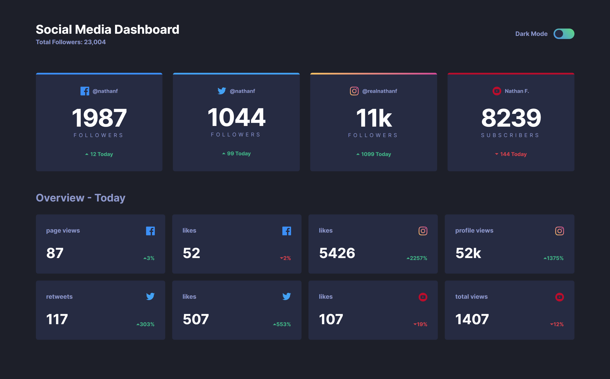

# Social media dashboard with theme switcher solution

This is a solution to the [Social media dashboard with theme switcher challenge on Frontend Mentor](https://www.frontendmentor.io/challenges/social-media-dashboard-with-theme-switcher-6oY8ozp_H). Frontend Mentor challenges help you improve your coding skills by building realistic projects. 

## Table of contents

- [Overview](#overview)
  - [The challenge](#the-challenge)
  - [Screenshot](#screenshot)
  - [Links](#links)
- [My process](#my-process)
  - [Built with](#built-with)
  - [What I learned](#what-i-learned)
  - [Continued development](#continued-development)
  - [Useful resources](#useful-resources)
- [Author](#author)


## Overview

### The challenge

Users are able to:

- View the optimal layout for the site depending on their device's screen size
- See hover states for all interactive elements on the page
- Toggle color theme to their preference

### Screenshot

## Desktop


### Links


- Solution URL: [Fontend-mentor](https://github.com/David-Henery4/Social-Media-Dashboard)
- Live Site URL: [Socials Board](https://socials-board.netlify.app)

## My process

### Built with

- Semantic HTML5 markup
- CSS custom properties
- Javascript
- Flexbox
- CSS Grid
- Mobile-first workflow
-[https://sass-lang.com] - CSS extension
- [Vite](https://v3.vitejs.dev) - Project tooling & bundling


### What I learned

This was quite a small project, so I used this project for practicing vanilla javascript, because I hadn't built anything in vanilla javascript in quite a while and it was fun to build a small project like this with it again.

Although I did learn something new, which was how to check for a users theme from their operating systems settings. I have built theme switchers in projects before, but I don't know why I have not set up this behavour in a theme switcher before, as I feel this should be the best way of setting up this feature.

I way I implemented this feature was by first checking if the user had already had been on the app first and had a theme preference stored in the local storage, if not then I would use "window.matchMedia("(prefers-color-scheme: dark)").matches" which would return a boolean to tell me if the user prefers dark mode or not. I would then use this to set the inital theme for the app.

You can see the full script of the theme switcher below.

To see how you can add code snippets, see below:

```js
const htmlDoc = document.documentElement;
const toggleBtn = document.getElementById("toggle-switch");
const toggleBall = document.getElementById("toggle-ball");

// CHECKS PREFERENCE
const useDark = window.matchMedia("(prefers-color-scheme: dark)");

// HANDLES THEME CHANGE ON CLICK
toggleBtn.addEventListener("click", () => {
  let theme;
  toggleBall.classList.toggle("toggle-active");
  htmlDoc.classList.toggle("darkMode");
  htmlDoc.classList.toggle("lightMode");
  if (htmlDoc.classList.contains("lightMode")) {
    theme = "lightMode";
    localStorage.setItem("theme", theme);
  }
  if (htmlDoc.classList.contains("darkMode")) {
    theme = "darkMode";
    localStorage.setItem("theme", theme);
  }
});

// HANLDES THEME CHANGE BASED ON USERS OS PREFERENCE
const handleThemeChange = (isDarkMode) => {
  if (isDarkMode) {
    htmlDoc.classList.add("darkMode");
    htmlDoc.classList.remove("lightMode");
    toggleBall.classList.add("toggle-active");
  }
  if (!isDarkMode) {
    htmlDoc.classList.add("lightMode");
    htmlDoc.classList.remove("darkMode");
    toggleBall.classList.remove("toggle-active");
  }
};

// CHECK IF IN LOCAL STORAGE OR
// SET BY PREFERENCE ON INITAL LOAD
const checkIfThemeStored = () => {
  htmlDoc.className = "lightMode";
  if (localStorage.getItem("theme")) {
    const theme = localStorage.getItem("theme");
    htmlDoc.className = theme
  }
  if (!localStorage.getItem("theme")) {
    // HANLDE THE CHANGE BASED ON INITAL PREFERENCE
    handleThemeChange(useDark.matches);
  }
};

checkIfThemeStored()

// LISTENS FOR CHANGES TO THE USERS PREFERENCE SETTINGS
useDark.addEventListener("change", (e) => handleThemeChange(e.matches));
```

### Continued development

I will, when using theme switching going forward, always now check for a users OS theme settings because, as someone who always prefers a dark theme, I feel this is the best way to implement such a feature and take the users settings into account.


### Useful resources

- [Dark mode website tutorial blog](https://www.ditdot.hr/en/dark-mode-website-tutorial) - This was the first time I implemented a theme toggle and checked for a users OS theme settings and I found this blog on setting up different ways of making a theme toggle. I used this to help me set up the theme for the users OS, but this blog goes into more depth about the different ways theme switching can be implemented, including dealing with images. Check it out if you have the time, it's a good read. 


## Author

- Website - [DJHWebdevelopment](https://www.djhwebdevelopment.com)
- Frontend Mentor - [@David-Henery4](https://www.frontendmentor.io/profile/David-Henery4)
- LinkedIn - [David Henery](https://www.twitter.com/yourusername)


